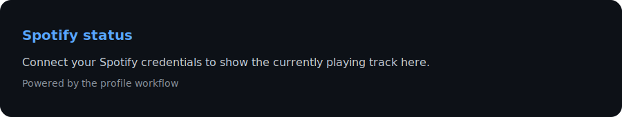
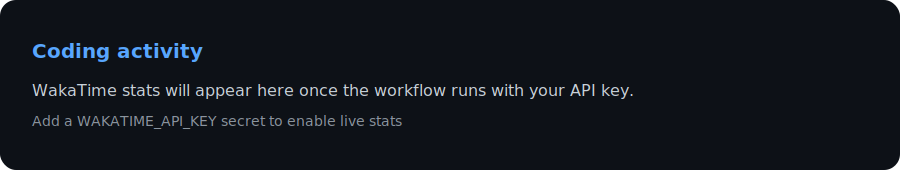

 

 

## 🚀 About me

- 🔭 I'm currently building polished, interactive digital experiences
- 🌱 Always learning new tools, frameworks, and techniques
- 💡 I love turning half-formed ideas into shipped projects
- ⚡ Fun fact: my favorite bug is the one that fixes itself

 

## 🛠️ Tech stack

## 📊 GitHub stats

## 🏆 Trophies

## 🐍 GitHub activity

## 🎧 Now playing

## ⏱️ Coding activity

## 💬 Quote of the day

## 📈 Metrics

## ✨ Highlights

| | |
|---|---|
| 🎨 | Clean, animated profile landing page |
| 🐍 | Automated GitHub contribution snake + metrics |
| 🎧 | Live Spotify "now playing" widget |
| ⏱️ | Auto-updating WakaTime coding stats |
| 💬 | Daily rotating quote of the day |
| 🔧 | Easy to fork and rebrand for your own profile |

## 🔗 Connect with me

 

<i>⭐ Thanks for stopping by — feel free to explore my repos!</i>

